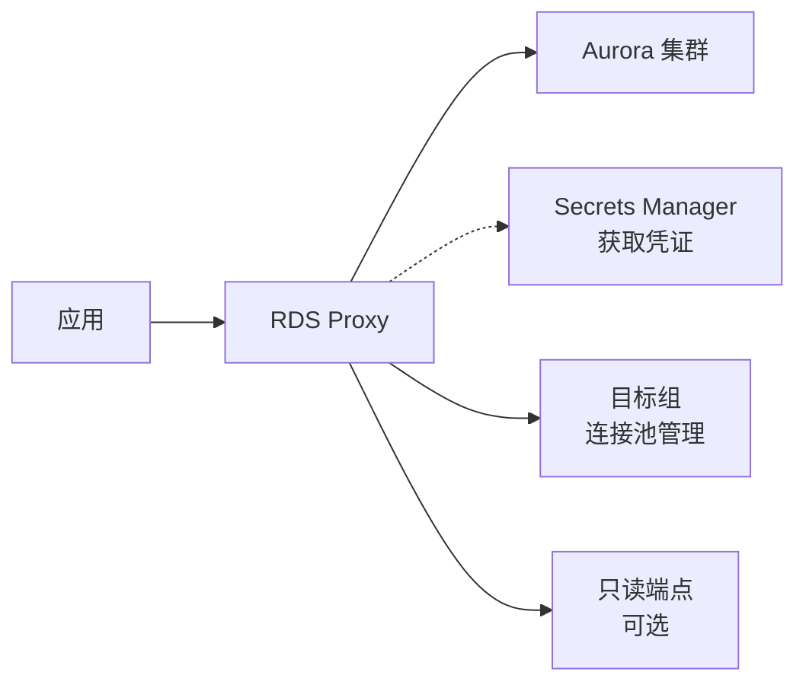

明白了，您是第一次搭建 Aurora PostgreSQL 数据库，当前的核心目标是 **只配置 RDS Proxy**（假设 Aurora 集群、VPC、子网、安全组等基础设施已经存在）。下面的步骤会从零开始，清晰说明每个 Terraform 代码块的作用，让您能按顺序成功创建出与截图完全一致的 RDS Proxy。

---

## 📌 前提条件（请先确认已有）

- ✅ 一个 **Aurora PostgreSQL 集群**（例如集群标识符 `tb-xxx-eu`）
- ✅ 该集群位于某个 **VPC** 中，并且有至少两个 **私有子网**（跨不同可用区）
- ✅ 数据库的 **用户名/密码** 已经保存在 **AWS Secrets Manager** 中（格式为 JSON，包含 `username`、`password`、`engine`、`port`、`host` 等字段）
- ✅ 您有足够的 IAM 权限创建 RDS Proxy 相关的角色和资源

> 如果上述资源尚未准备，可以参考之前的完整方案先创建 Aurora 集群。但本文聚焦于 **Proxy 的配置**，会引用这些已存在的资源。

---

## 🧩 整体架构图（新加组件）



---

## 一、创建 IAM 角色与策略（让 Proxy 能读取 Secrets Manager）

RDS Proxy 必须被授权从 Secrets Manager 中读取数据库凭证。因此我们需要一个 IAM 角色，并附加相应的策略。

### 代码 `iam-proxy-role.tf`

```hcl
# 1. IAM 角色：允许 RDS 服务代入此角色
resource "aws_iam_role" "rds_proxy" {
  name = "tb-xxx-eu-rds-proxy-role"          # 与截图中的角色名一致
  assume_role_policy = jsonencode({
    Version = "2012-10-17"
    Statement = [
      {
        Action = "sts:AssumeRole"
        Effect = "Allow"
        Principal = {
          Service = "rds.amazonaws.com"       # 只有 RDS 服务可以代入该角色
        }
      }
    ]
  })
}

# 2. IAM 策略：允许读取指定的 Secret
resource "aws_iam_policy" "secrets_manager" {
  name = "rds-proxy-secrets-policy"
  policy = jsonencode({
    Version = "2012-10-17"
    Statement = [
      {
        Effect   = "Allow"
        Action   = ["secretsmanager:GetSecretValue"]   # 仅允许获取 Secret 值
        Resource = ["arn:aws:secretsmanager:eu-west-1:959491356696:secret:fxps/xxx/rds/sa/secret-rBe6OT"]  # 替换为您的 Secret ARN
      }
    ]
  })
}

# 3. 将策略附加到角色
resource "aws_iam_role_policy_attachment" "attach" {
  role       = aws_iam_role.rds_proxy.name
  policy_arn = aws_iam_policy.secrets_manager.arn
}
```

### 📝 每段代码的作用

- **`aws_iam_role`**：创建一个 IAM 角色，并设置信任关系（Trust Policy）。`Principal` 指定了 `rds.amazonaws.com`，意味着只有 AWS RDS 服务可以“扮演”这个角色。
- **`aws_iam_policy`**：定义一个策略，授予 `secretsmanager:GetSecretValue` 权限。`Resource` 填写您 Secret 的完整 ARN（可以在 Secrets Manager 控制台找到）。
- **`aws_iam_role_policy_attachment`**：把上面创建的策略附加到角色上，使角色真正拥有读 Secret 的权限。

> **为什么需要这个角色？**  
> RDS Proxy 本质上是一个托管服务，它需要代表您去访问 Secrets Manager 以获取数据库密码。通过 IAM 角色，我们显式授权了这种访问。

---

## 二、创建 RDS Proxy 主体

这一步创建真正的代理资源，包括网络、认证、加密等配置。

### 代码 `rds-proxy-main.tf`

```hcl
# 4. 获取已经存在的子网（必须与 Aurora 集群在同一 VPC 且支持 Proxy）
data "aws_subnets" "database" {
  filter {
    name   = "vpc-id"
    values = ["vpc-xxxxxxxx"]                # 替换为实际 VPC ID
  }
  tags = {
    Tier = "database"                         # 根据您子网的实际情况筛选
  }
}

# 也可直接通过 ID 列表指定（推荐）
variable "database_subnet_ids" {
  description = "List of subnet IDs where RDS Proxy will be deployed (must be at least two in different AZs)"
  type        = list(string)
  default     = ["subnet-0356df54e54e8efa43", "subnet-0dd8bf7f0fd60c0a"]   # 替换为您的子网 ID
}

# 5. 引用已经存在的安全组（允许应用访问 Proxy 的 5432 端口）
data "aws_security_group" "proxy_sg" {
  id = "sg-04fb7151052ef8f22"               # 从截图中获取的安全组 ID
}

# 6. 创建 RDS Proxy
resource "aws_db_proxy" "main" {
  name                   = "tb-xxx-eu-rds-proxy"          # 与截图一致
  role_arn               = aws_iam_role.rds_proxy.arn
  engine_family          = "POSTGRESQL"                   # 您的引擎族
  vpc_subnet_ids         = var.database_subnet_ids        # 至少两个子网
  vpc_security_group_ids = [data.aws_security_group.proxy_sg.id]
  idle_client_timeout    = 1800                           # 30 分钟，与截图相同
  require_tls            = true                           # 强制 TLS
  debug_logging          = false

  auth {
    auth_scheme = "SECRETS"                               # 使用 Secrets Manager 认证
    secret_arn  = "arn:aws:secretsmanager:eu-west-1:959491356696:secret:fxps/xxx/rds/sa/secret-rBe6OT"  # 替换
    iam_auth    = "DISABLED"                              # 此处不启用 IAM 认证（截图显示默认认证为 None）
  }
}
```

### 📝 每段代码的作用

- **`data "aws_subnets"` 或 `var.database_subnet_ids`**：告诉 Proxy 它应该部署在哪些子网中。**关键**：这些子网必须与 Aurora 集群所在的子网一致，并且至少跨越两个可用区（且每个 AZ 都支持 RDS Proxy）。截图中有三个子网，您可以直接填入它们的 ID。
- **`data "aws_security_group"`**：引用已存在的安全组。该安全组应开放 **5432** 端口入站规则，以便应用程序能够连接到 Proxy。同时，该安全组出站必须允许 **443** 端口（访问 Secrets Manager），否则 Proxy 会卡在 `PENDING_PROXY_CAPACITY`。
- **`aws_db_proxy`**：核心资源。
  - `name`：在 AWS 控制台中显示的代理标识符。
  - `role_arn`：指向上面创建的 IAM 角色，让 Proxy 能够获取凭证。
  - `engine_family`：指定数据库引擎类型（`POSTGRESQL` 或 `MYSQL`）。
  - `vpc_subnet_ids`：Proxy 的弹性网络接口将附着在这些子网上。
  - `idle_client_timeout`：客户端空闲超过该时间后，Proxy 会关闭连接（默认 1800 秒）。
  - `require_tls`：强制应用与 Proxy 之间的通信使用 TLS 加密。
  - `auth` 块：定义认证方式。`auth_scheme = "SECRETS"` 表示从 Secrets Manager 中获取凭证；`secret_arn` 就是您存储数据库用户名/密码的那个 Secret 的 ARN。

> **安全组注意点**：  
> 截图中的 `sg-04fb7151052ef8f22` 是 Proxy 的安全组。请确保它有一条**出站规则**：类型 HTTPS (443)，目标 `0.0.0.0/0`（或 Secrets Manager 的 VPC Endpoint）。否则 Proxy 无法拉取密码，创建过程会失败。

---

## 三、配置目标组（Target Group）—— 管理连接池

目标组控制 Proxy 如何与数据库建立连接，包括最大连接数、空闲连接处理等。

### 代码 `rds-proxy-target-group.tf`

```hcl
# 7. 创建默认目标组（与 Proxy 自动关联）
resource "aws_db_proxy_default_target_group" "main" {
  db_proxy_name = aws_db_proxy.main.name

  connection_pool_config {
    max_connections_percent      = 100          # 允许 Proxy 使用数据库 100% 的连接
    max_idle_connections_percent = 50           # 空闲连接池上限为最大连接的 50%
    connection_borrow_timeout    = 120          # 等待连接可用的超时秒数
    session_pinning_filters      = ["EXCLUDE_VARIABLE_SETS"]   # 减少 session pinning
  }
}
```

### 📝 代码作用

- **`aws_db_proxy_default_target_group`**：每个 RDS Proxy 都有一个默认目标组，用来定义连接池的行为。
  - `max_connections_percent`：Proxy 可以占用的数据库最大连接数的百分比（100% 表示可以完全用完数据库的 `max_connections`）。生产中建议设为 80-90%，留一些给直接管理访问。
  - `max_idle_connections_percent`：当空闲连接数超过此比例时，Proxy 会主动关闭多余的空闲连接。50% 是一个合理的中间值。
  - `connection_borrow_timeout`：应用程序请求连接时，如果池中没有可用连接，Proxy 会等待最多 120 秒。超时后返回错误。
  - `session_pinning_filters`：指定哪些 SQL 语句会导致“会话固定”（即连接不能被其他客户端复用）。`EXCLUDE_VARIABLE_SETS` 表示忽略 `SET` 命令（例如 `SET timezone`）作为固定条件，从而提高连接复用率。

> **目标组的作用**：  
> 它告诉 Proxy 以怎样的策略去管理数据库侧的连接池。合理配置这些参数可以极大提升高并发场景的性能。

---

## 四、将 Proxy 关联到 Aurora 集群（目标）

Proxy 本身只是一个空壳，还需要告诉它后端数据库是哪一个（集群或实例）。

### 代码 `rds-proxy-target-attach.tf`

```hcl
# 8. 获取 Aurora 集群信息（假设集群已存在）
data "aws_rds_cluster" "aurora" {
  cluster_identifier = "tb-xxx-eu"            # 替换为您的集群标识符
}

# 9. 将 Proxy 的目标设置为该集群
resource "aws_db_proxy_target" "aurora_cluster" {
  db_proxy_name          = aws_db_proxy.main.name
  target_group_name      = aws_db_proxy_default_target_group.main.name
  db_cluster_identifier  = data.aws_rds_cluster.aurora.cluster_identifier
}
```

### 📝 代码作用

- **`data "aws_rds_cluster"`**：通过数据源查询已经存在的 Aurora 集群，获取它的端点等信息。
- **`aws_db_proxy_target`**：将 Proxy 的目标组与具体的数据库集群关联起来。您也可以关联 RDS 实例（使用 `db_instance_identifier`），这里使用 `db_cluster_identifier` 来关联 Aurora 集群。

> 执行此步后，Proxy 就完全“指向”了您的数据库，应用可以通过 Proxy 的端点（稍后会看到）来连接数据库了。

---

## 五、（可选）创建只读端点

截图显示有两个代理端点，其中一个标记为 `read-only-endpoint`。如果您希望将读流量和写流量分开，可以创建只读端点。

### 代码 `rds-proxy-readonly-endpoint.tf`

```hcl
# 10. 创建只读端点（将流量路由到 Aurora 的只读副本）
resource "aws_db_proxy_endpoint" "read_only" {
  db_proxy_name          = aws_db_proxy.main.name
  db_proxy_endpoint_name = "read-only-endpoint"
  vpc_subnet_ids         = var.database_subnet_ids
  target_role            = "READ_ONLY"            # 关键：指定只读角色
}
```

### 📝 代码作用

- **`aws_db_proxy_endpoint`**：为一个已有的 Proxy 添加额外的端点。每个端点可以有不同的 VPC 配置和目标角色（`READ_ONLY` / `READ_WRITE`）。
- `target_role = "READ_ONLY"`：告诉 Proxy 该端点的后端应指向集群的只读副本（如果有）。如果没有只读副本，该端点将仍然指向主实例，但连接会被标记为只读。
- 使用场景：应用程序的复杂查询可以走只读端点，减轻主实例压力，并且可以利用只读副本的扩展能力。

---

## 六、应用连接方式（示例）

创建成功后，您会在控制台看到两个端点：

- **读写端点**：`tb-xxx-eu-rds-proxy.proxy-xxxxxx.eu-west-1.rds.amazonaws.com`
- **只读端点**：`tb-xxx-eu-rds-proxy.read-only.endpoint.proxy-xxxxxx.eu-west-1.rds.amazonaws.com`

应用连接时，使用标准的 PostgreSQL 连接字符串：

```javascript
// 读/写操作
const client = new Client({
  host: 'tb-xxx-eu-rds-proxy.proxy-xxxxxx.eu-west-1.rds.amazonaws.com',
  port: 5432,
  user: 'db_admin',           // 从 Secret 中获取
  password: 'your_password',
  database: 'xxdb',
  ssl: true
});

// 只读操作
const readOnlyClient = new Client({
  host: 'tb-xxx-eu-rds-proxy.read-only.endpoint.proxy-xxxxxx.eu-west-1.rds.amazonaws.com',
  port: 5432,
  user: 'db_admin',
  password: 'your_password',
  database: 'fxdb',
  ssl: true
});
```

> **注意**：用户名和密码仍然使用 Secrets Manager 中存储的值，但连接地址变成了 Proxy 的端点。Proxy 会自动将请求转发给 Aurora 集群。

---

## 七、部署与验证步骤

1. **初始化 Terraform**  
   ```bash
   terraform init
   ```

2. **查看执行计划**  
   ```bash
   terraform plan
   ```
   确认要创建的资源：IAM 角色、策略、Proxy、目标组、目标关联等。

3. **应用配置**  
   ```bash
   terraform apply -auto-approve
   ```
   创建过程大约需要 5-10 分钟（Proxy 需要启动并验证网络连通性）。

4. **验证状态**  
   - 登录 AWS 控制台 → RDS → Proxies  
   - 您应该看到 `tb-xxx-eu-rds-proxy` 状态为 **Available**
   - 查看 **Target groups** 标签页，`Default` 目标组应该显示“已关联数据库”
   - 查看 **Proxy endpoints** 标签页，应该有两个端点（如果创建了只读端点）

5. **连接测试**  
   使用 `psql` 或应用程序尝试连接 Proxy 的端点，执行 `SELECT 1;` 验证连通性。

---

## 八、常见问题排查

### ❌ Proxy 创建后长时间处于 `PENDING_PROXY_CAPACITY` 状态

- **原因**：通常是安全组出站 443 端口不通，或者子网没有 NAT/Internet 网关/VPC Endpoint 导致无法访问 Secrets Manager。
- **解决**：
  - 检查 Proxy 安全组的出站规则，确保有 HTTPS（443）到 `0.0.0.0/0` 或 Secrets Manager 的 VPC Endpoint。
  - 如果子网是私有子网且没有 NAT 网关，必须创建 `secretsmanager` 的 VPC Endpoint。

### ❌ 连接失败：`timeout` 或 `connection refused`

- **原因**：
  - 应用所在的安全组未允许出站到 Proxy 的 5432 端口。
  - Proxy 的目标组中 `connection_borrow_timeout` 设置过短。
- **解决**：调整安全组规则，或增加 `connection_borrow_timeout` 的值。

### ❌ Terraform 报错：`InvalidParameterValue: DBProxy Target is waiting for proxy to scale`

- **原因**：Proxy 尚未完全就-绪时就尝试添加目标。Terraform 通常会等待，但有时也会出现依赖缺失。
- **解决**：在 `aws_db_proxy_target` 资源中添加 `depends_on = [aws_db_proxy.main]` 或使用 `time_sleep` 资源等待 60 秒。

---

## 总结：您新增的代码及其作用一览

| 资源类型 | 资源名称 | 作用 |
|---------|---------|------|
| `aws_iam_role` | `rds_proxy` | 授予 RDS 服务代入权限 |
| `aws_iam_policy` | `secrets_manager` | 定义读取 Secret 的权限 |
| `aws_iam_role_policy_attachment` | `attach` | 将策略绑定到角色 |
| `aws_db_proxy` | `main` | 创建 RDS Proxy 实例（网络、认证、TLS） |
| `aws_db_proxy_default_target_group` | `main` | 配置连接池参数 |
| `aws_db_proxy_target` | `aurora_cluster` | 将 Proxy 指向您的 Aurora 集群 |
| `aws_db_proxy_endpoint` | `read_only` | （可选）创建只读分离端点 |

通过以上步骤，您就能独立完成 RDS Proxy 的配置，并理解每一行代码的意图。如果还有疑问，欢迎继续提问！
